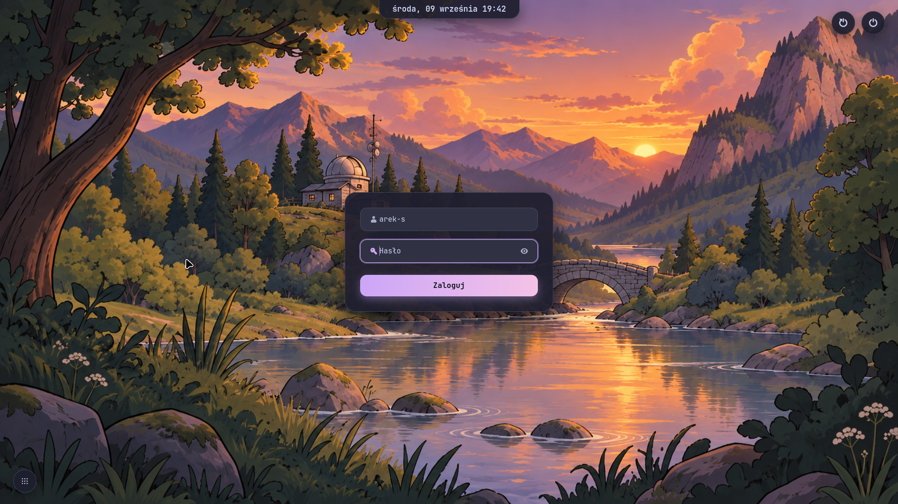
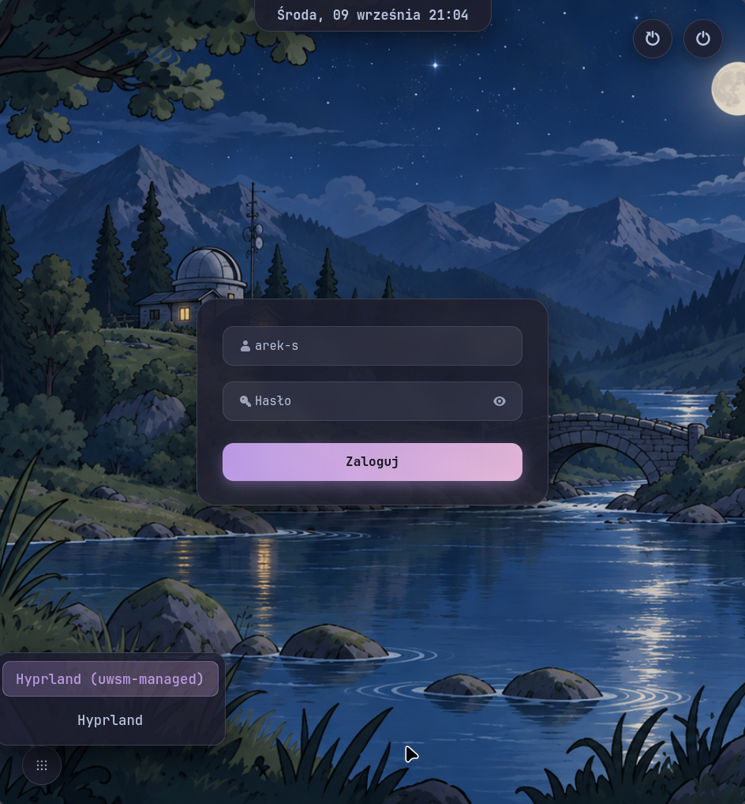

<div align="center">

# 🌙 neogreet

**A sleek, modern Catppuccin Mocha greeter for `greetd` on Wayland.**

[](https://opensource.org/licenses/MIT)
[](https://www.python.org/)
[](https://www.gtk.org/)
[](https://wayland.freedesktop.org/)

<br />



<br />

*Session Selector Popover:*



</div>

---

## ✨ Features

- **🎨 Catppuccin Mocha Aesthetic**: Designed from the ground up to match modern Rofi & Waybar aesthetics with deep translucent backgrounds (`#1e1e2eee`), subtle borders, and glowing lavender-to-pink gradients (`#cba6f7` → `#f5c2e7`).
- **🔑 Clean, Integrated Inputs**:
  - Primary user icon embedded directly inside the username field.
  - Key icon embedded directly inside the password field, alongside a peek toggle eye icon.
  - Full-width action button matching input field dimensions.
  - Automatic initial focus on the password field for instant login.
- **⚡ Asynchronous & Non-Blocking**:
  - PAM authentication exchange runs on a dedicated background worker thread (`threading.Thread`), keeping the GTK main loop responsive and fluid even during heavy cryptographic key stretching (bcrypt / argon2).
  - Short-read safe socket protocol implementation (`_recv_exact`).
- **🎛️ Bottom-Left Session Selector**:
  - Unobtrusive circular icon button in the lower-left corner.
  - Pops up a clean floating card scanning available `.desktop` sessions from `/usr/share/wayland-sessions/`.
  - Automatically remembers your last selected session across reboots.
- **⏻ Quick Power Controls**:
  - Circular **Reboot** and **Power Off** buttons neatly positioned in the upper-right corner with soft hover glows.
- **🧪 Built-in Demo Mode (`--demo`)**:
  - Test and preview the greeter directly inside your active desktop environment without locking the screen or restarting `greetd`.
  - Press `ESC` to exit demo mode cleanly.
- **🪶 Ultra Lightweight**:
  - Pure Python 3 + GTK4 (`python-gobject`).
  - Zero heavy rust compilation steps, zero Electron/Node overhead, zero pip dependencies.
  - Communicates directly with the `greetd` UNIX socket (`$GREETD_SOCK`) using standard library modules (`socket`, `struct`, `json`).

---

## 📦 Requirements

- **Linux** with Wayland
- **[`greetd`](https://git.sr.ht/~kennylevinsen/greetd)**
- **`python`** (>= 3.10)
- **`python-gobject`** (PyGObject with GTK4)
- **`gtk4`**
- **`papirus-icon-theme`** (for clean symbolic icons)
- Any lightweight Wayland compositor to host the greeter (e.g. **Hyprland**, **Sway**, or **Cage**).

---

## 🚀 Installation

### Arch Linux (Manual / PKGBUILD)

```bash
git clone https://github.com/neoth-revelation/neogreet.git
cd neogreet
makepkg -si
```

### Manual Install (Any Distribution)

```bash
git clone https://github.com/neoth-revelation/neogreet.git
cd neogreet
sudo install -m 755 bin/neogreet /usr/local/bin/neogreet
```

---

## ⚙️ Configuration

### 1. Configure `greetd` (`/etc/greetd/config.toml`)

Configure `greetd` to launch your chosen Wayland compositor running as the `greeter` user:

```toml
[terminal]
vt = 1

[default_session]
command = "Hyprland --config /etc/greetd/hyprland.conf"
user = "greeter"
```

### 2. Configure Compositor (`/etc/greetd/hyprland.conf`)

An example minimal Hyprland configuration for `greetd`:

```ini
cursor {
    no_hardware_cursors = true
}

input {
    kb_layout = pl
    follow_mouse = 1
}

general {
    border_size = 0
    gaps_in = 0
    gaps_out = 0
}

decoration {
    rounding = 0
    shadow {
        enabled = false
    }
    blur {
        enabled = false
    }
}

animations {
    enabled = false
}

misc {
    disable_hyprland_logo = true
    disable_splash_rendering = true
}

# Pin fullscreen window to primary display if multi-monitor
windowrule = match:class ^(apps\.neoth\.neogreet|neogreet)$, fullscreen on

# Launch wallpaper & greeter
exec-once = swaybg -i /usr/share/backgrounds/greeter.png -m fill
exec-once = neogreet; hyprctl dispatch exit
```

---

## 🧪 Interactive Demo Mode

Test `neogreet` anytime from your active terminal:

```bash
neogreet --demo
# or shorter:
neogreet -d
```

- Spawns in a floating 1280x720 window.
- Safe power buttons (simulates reboot/shutdown without affecting your machine).
- Test login with any password (enter `wrong` to test authentication error feedback).
- Press `ESC` to close the window.

---

## 📄 License

Distributed under the **MIT License**. See [`LICENSE`](LICENSE) for more information.

---

<div align="center">
Made with ❤️ by <a href="https://github.com/neoth-revelation">neoth-revelation</a>
</div>
